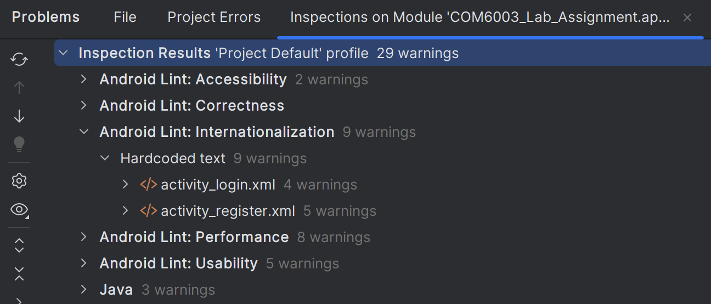

# COM6003_Lab_Assignment
The aim of this assignment is to develop a Hospital Management App (HMP) to rationalise hospital operations by creating a secure, efficient, and user-friendly platform for admins to manage patients, doctors, surgeries, and appointments.

A development process will be outlined in this README file involving sprints which are directly correlated to the labs provided in the sessions.

### Lab 1 - Gathering User Requirements
To begin with, I will be breaking down the core functionalities of the HMP into Epics and  into their corresponding user stories.
These methods of requirement gathering are used to outline functional requirements, with the security-focused evil user stories highlighting potential risks and vulnerabilities.

Epics will be split into the Business Requirements and Functionalities provided by the brief in order to meet all the desired requirements and explore where the security risks may lie and what core functional requirements are needed.
My method of requirement gathering is to give the key points "ID"s to allow easier review and referencing later in the project. IDs will be given to both the Epics and the User Stories, with the Acceptance Criteria, and Evil User Stories following these in a table format.

| **Epic ID** | **Epic Title**                              | **User Story ID** | **User Story**                                                                                                               | **Acceptance Criteria**                                                                                                                                                                                                                                               | **Evil User Story**                                                                                                          |  
|-------------|---------------------------------------------|-------------------|------------------------------------------------------------------------------------------------------------------------------|-----------------------------------------------------------------------------------------------------------------------------------------------------------------------------------------------------------------------------------------------------------------------|------------------------------------------------------------------------------------------------------------------------------|  
| **1**       | **User Authentication and Role Management** | 1.1               | As a user, I want to log in securely using a username and password so that I can access my account.                          | Users must log in successfully with valid credentials. Passwords must meet security standards (e.g., 8+ characters for SHA-256 to be optimal, alphanumeric, special character). Failed login attempts are logged.                                                     | As an attacker, I want to use brute-force attacks to guess user passwords and gain unauthorised access.                      |  
|             |                                             | 1.2               | As a user, I want to reset my password securely if I forget it.                                                              | Password reset requests require email or multi-factor authentication (MFA). Temporary tokens expire after 15 minutes. New passwords must differ from the last used.                                                                                                   | As an attacker, I want to take advantage of password reset links to take control of a legitimate user's account.             |  
|             |                                             | 1.3               | As a user, I want to log out of the system to prevent unauthorised access to my session.                                     | Users are logged out immediately after clicking the logout button. Idle sessions timeout after 10 minutes of inactivity.                                                                                                                                              | As an attacker, I want to keep a user's session active after they log out so I can continue accessing sensitive information. |  
| **2**       | **Patient Management**                      | 2.1               | As an admin, I want access to view and update patient's information so that I can assess and change any details as required. | Admin dashboard can view a list of patients, being able to select them, modify their details and save the changes. Any unauthorised access attempts are logged, as well as changes to any data.                                                                       | As an attacker, I want to spoof an admin account to view and tamper with sensitive information.                              |  
|             |                                             | 2.2               | As an admin, I want to delete a patient if they are no longer required in the database safely and securely.                  | Admin can delete a user by long-pressing on the patient, with confirmation since important information can be lost easily on accident. Any unauthorised access attempts to others data are logged and deleted data creates a signature to keep track of changes made. | As an attacker, I want to delete a patient's data to cause disruption to patients receiving care.                            |  
| **3**       | **Appointment Management**                  | 3.1               | As a user, I want to view the schedules between doctors and patients.                                                        | Admin can view all of a doctor's and patient's appointment. Data is encrypted so can only be viewed in the dashboard.                                                                                                                                                 | As an attacker, I want to invade patient's privacy by viewing the patient's appointments and doctor's schedule.              |  
|             |                                             | 3.2               | As an admin, I want to manage appointments between doctors and patients.                                                     | Admin will be able to manage appointments between doctors and patients in parallel with data integrity and encryption. Changes are logged and visible to all authorised users.                                                                                        | As an attacker, I want to change a doctor's availability to cause scheduling conflicts.                                      |  
| **4**       | **Security and Audit Logging**              | 4.1               | As an admin, I want to view logs of all user activities for auditing purposes.                                               | Logs must include timestamps, user IDs, and actions performed. Logs must be protected against tampering, e.g. read-only.                                                                                                                                              | As an attacker, I want to delete or modify audit logs to cover up malicious actions.                                         |  
|             |                                             | 4.2               | As a system, I want to detect suspicious activity like failed logins or unauthorised access attempts.                        | Suspicious activities trigger alerts. Logs are kept and analysed for potential threats.                                                                                                                                                                               | As an attacker, I want to bypass security alerts to avoid detection while performing malicious activities.                   |  
| **5**       | **System Administration and Monitoring**    | 5.1               | As an admin, I want to monitor the system's performance.                                                                     | Admins can view system performance metrics securely. Performance logs are encrypted and accessible only to authorised users.                                                                                                                                          | As an attacker, I want to gain access to system performance data to identify vulnerabilities.                                |  
|             |                                             | 5.2               | As an admin, I want to configure alerts for system failures or breaches.                                                     | Alerts for system failures are configurable and sent to authorised users. Logs of alert configurations are stored.                                                                                                                                                    | As an attacker, I want to disable alerts to avoid detection of system breaches or failures.                                  |  
| **6**       | **Integration with Other Departments**      | 6.1               | As an admin, I want to integrate with other department systems to view patient test results.                                 | External system integrations must be secure. Data is encrypted during transit and is accessible only to authorised users.                                                                                                                                             | As an attacker, I want to inject malicious data through an different department integration to compromise the hospital data. |  
|             |                                             | 6.2               | As an admin, I want to access patient data from pharmacies securely.                                                         | Patient data from pharmacies is integrated securely and encrypted.                                                                                                                                                                                                    | As an attacker, I want to access external pharmacy data to gather sensitive patient information.                             |  
| **7**       | **Regulatory Compliance Features**          | 7.1               | As an admin, I want to ensure the app complies with GDPR regulations by managing data retention.                             | Personal data is stored according to GDPR requirements. Consent logs are maintained and accessible to authorised users.                                                                                                                                               | As an attacker, I want to erase consent records to evade compliance audits.                                                  |  
|             |                                             | 7.2               | As a user, I want to delete my personal data from the system when I no longer need the service.                              | Data deletion requests are securely processed, and logs are kept. Data is fully erased after deletion.                                                                                                                                                                | As an attacker, I want to recover deleted data to gather sensitive user information.                                         | 

With the use of these Epic User Stories, I can easily uncover the core functionalities and security requirements outlined in the brief while aligning with the business goals and objectives.
These stories will be continuously referenced throughout development to ensure that functional requirements are being met and security is efficient.

### Lab 2 - Threat Modelling
The report document can be found in the first section of the file directory for this project in the zip file.

### Lab 3 - User Authentication (Developing Login and Registration)
The objective of this sprint is to design the login and registration screen for the app, ensuring user authentication and setting foundation for accessing the app securely.

This sprint covers initial design of screens and addressing user story 1.1.

The relevant screens for the sprint have been developed and functional, along with necessary security features that are needed for GitHub at the moment.
The data validation has been complete. All fields must not be empty. Password must contain: 8+ characters, at least 1 character, number, and special character. The username the user chooses must not already exist in the database to avoid conflicts. The email must be in the correct format, at least 1 character before @, then a letter followed by ".com". The password gets entered into the database hashed with SHA-256 and other sensitive data like username and email are encrypted. The only thing left for 1.1 is logging failed attempts which will be completed in a later sprint.

#### Testing
Testing will be conducted at the end of each sprint to ensure that everything is working efficiently and correctly. These will be broken down into static, dynamic and edge case testing.

##### Static Testing
After reviewing the code, I believe common practices are followed with naming conventions, functions, and database handling. The UI is going to be basic for this project as the main criteria is checking secure development and deployment over UI design and I want to ensure this is done to a high standard rather than spending loads of time on the UI.

Using Android Studio's Lint to inspect code and output any issues or warnings with the code provided no glaring errors with the project, just some preference changes with the hardcoded text.

##### Dynamic Testing & Edge Cases
Testing for running the app was conducted on my own Google Pixel 5.

Test cases have been developed to ensure all aspects of the app that have been added in this sprint are being tested with the expected and actual outcomes recorded to see if any changes are needed.

| **Test Case**                | **Description**                                                                                                                                                                                                              | **Expected Outcome**                                                                                                         | **Actual Outcome**                                                                                                                               |
|------------------------------|------------------------------------------------------------------------------------------------------------------------------------------------------------------------------------------------------------------------------|------------------------------------------------------------------------------------------------------------------------------|--------------------------------------------------------------------------------------------------------------------------------------------------|
| **Login and Registration**   | Tested the functionality. Entering valid credentials logs the user in and navigates to the placeholder. Invalid credentials displays a Toast message.                                                                        | The app should accept valid credentials and navigate to placeholder. If error occurs, display message.                       | The app ran as expected, with correct navigation upon successful login and appropriate error messaging for failed attempts.                      |
| **User Input Validation**    | If the fields are left empty, a toast message is shown. If the password doesn't meet the requirements mentioned in user story 1.1, an error is displayed. For registration, if the passwords do not match, display an error. | Empty fields and invalid passwords should display an error.                                                                  | App correctly display corresponding error messages for what is the issue.                                                                        |
| **Database Interaction**     | Test whether user data is correctly added to the database during registration. Data should not be added if the credentials do not meet requirements.                                                                         | User data should be saved in the database and be retrievable for login authentication. Data should not be stored if invalid. | User data is successfully saved and retrieved for login. Credentials are not stored if the input is not correct.                                 |
| **Feedback Messages**        | Test if the toast messages displayed provide significant information to the user for what the issue is.                                                                                                                      | Appropriate feedback should appear when users interact with the app, such as success and error messages.                     | Feedback messages display correctly based on user input, providing clear error messages such as declaring what exactly is missing from password. |

### Lab 4 - Patient Management